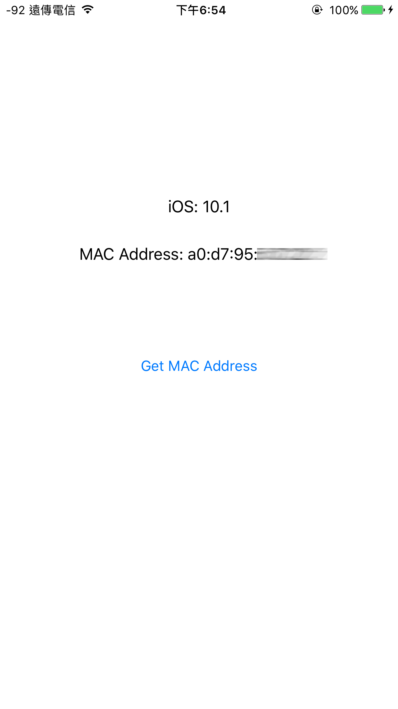

# iOSGetMACAddress
iOS another way to get mac address after iOS 7.

## Why
Since iOS 7.0, you cannot easily using sysctl() or ioctl() to get MAC address(normal way).
 
[Link (the most bottom)](https://developer.apple.com/library/content/releasenotes/General/WhatsNewIniOS/Articles/iOS7.html)

## Steps
1. Connection to any Wi-Fi.
2. Get current IP address of Wi-Fi.
3. Send ICMP echo request(ping) to the IP address.(not the IP address, 127.0.0.1)
4. Walk ARP table to search the MAC address of current IP address of Wi-Fi.
5. Get your MAC address.

## Result

